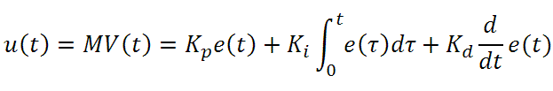
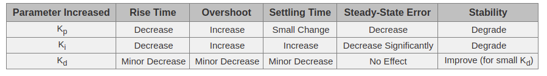

#### Udacity Self-driving Car Nanodegree
# Project 8: PID Control


## Overview
A PID control is a closed loop feedback controller that helps keeping the system at a desired state. The PID controller continuously calculates the error $e(t)$ as the difference between the desired value (Set Point, SP) and the measured value of a Process Variable (PV). This error is then used to to adjust the process value by applying three types of control: 

* Proportional: Adjustment is applied proportional to current error
* Integral: Adjustment is applied based on the accumulated error
* Derivative: Adjustment is applied based on the rate of error ($\frac{de}{dt}$)

A PID controller applies all three controls (Proportional, Integral, and Derivative). It is also possible to apply only Proportional (P Control) or a combination of the Proportional and Derivative control (PD Control). 

The control function of a PID controller is a weighted sum of the above control components. The weights are called gains: 


<br />


The following table ([ref](https://www.thorlabs.com/tutorials.cfm?tabID=5dfca308-d07e-46c9-baa0-4defc5c40c3e)) shows the effect of each gain on the behavior of the systems: 



### Tuning the value of gains
There are different approaches for tuning the value of gains. The manual approach by observing the behavior of the system leads to good results but requires experiences. I used the following strategy for manually tuning the gains ([ref][(](https://robotics.stackexchange.com/a/174/26634))): 

1. set all gains to zero
2. increase the P gain till the system reaches steady oscillation
3. increase the D gain till oscillation disappears
4. increase both P and D gain till the D Control cannot damp the oscillation anymore
5. increase the I gain till the desired time till reaching the set point is achieved and any systematic bias (steady error) is removed. 

Beside the manual tuning approach, it is also possible to use other parameter tuning approaches such as [coordinate descent](https://en.wikipedia.org/wiki/Coordinate_descent), or use heuristics such as [Ziegler–Nichols tuning method](https://en.wikipedia.org/wiki/Ziegler%E2%80%93Nichols_method). 

### Steering, Speed, and Throttle
The steering value between -1 and 1 is I utilized a PID control with the set point value of steering equal 0. The PID uses the following gains: `K_p=0.2; K_i=0.001; K_d=1.5`, and uses the Cross Track Error (CTE) as error signal. 

```cpp
    pid_steer.Init(0.2, 0.001, 1.5);
    double steer_value = 0.0;
    pid_steer.UpdateError(cte);
    steer_value = pid_steer.TotalError();
```

I also utilized a PD control for adapting the target speed to absolute value of the CTE. The parameters of the speed control were also tuned as described above (`K_p=5.0; K_d=3.0`): 

```cpp
    pid_speed.Init(5.0, 0, 3.0);
    double target_speed = 25.0;
    pid_speed.UpdateError(abs(cte));
    target_speed = target_speed + pid_speed.TotalError();
```

Finally, a P Control (`K_p=0.07`) adapts the value of throttle to the speed error (the difference between current speed and the target speed): 

```cpp
    pid_throttle.Init(0.07, 0, 0);
    double speed_error = target_speed - speed;
    pid_throttle.UpdateError(speed_error);
    double target_throttle = 0.5;
    double throttle = target_throttle - pid_throttle.TotalError();
```

## Demo


## Build and Setup

The project requires [Udacity's simulator](https://github.com/udacity/self-driving-car-sim/releases).

```
1. Make a build directory: `mkdir build && cd build`
2. Compile: `cmake .. && make`
3. Run it: `./pid`. 
4. Start the simulator. 
```
